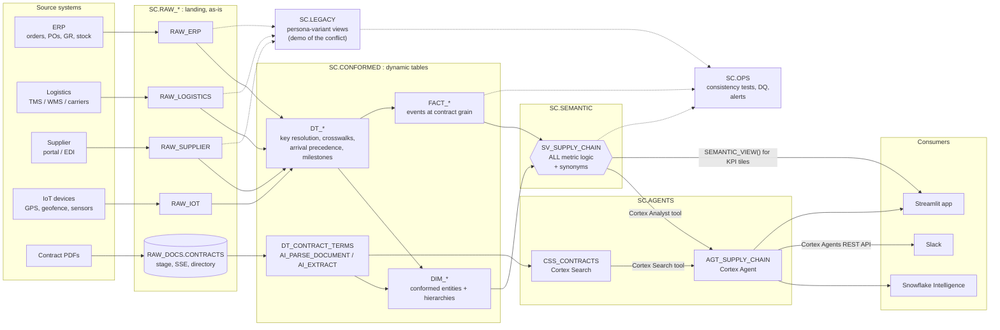

# Architecture

How raw ERP, logistics, supplier and IoT data becomes **one** set of metric answers, served the same way to every surface.

**Principles**
1. **One definition, one place.** Metric logic (windows, population filters, numerators, denominators, ratios) lives **only** in the semantic view `SC.SEMANTIC.SV_SUPPLY_CHAIN`, implementing [`metric_contracts.md`](metric_contracts.md). No dashboard, agent, notebook or dynamic table recomputes a metric.
2. **Everything downstream reads the semantic view.** Cortex Agents, Streamlit, Snowflake Intelligence and Slack all go through it (via Cortex Analyst or `SEMANTIC_VIEW()`), so they cannot disagree.
3. **Layers only flow forward.** RAW → CONFORMED → SEMANTIC → AGENTS → consumers. Nothing reads backwards or skips a layer.
4. **Persona access is read-only on the top two layers.** Persona roles see `SEMANTIC` and `AGENTS` only (`sql/00_setup.sql`).

---

## 1. Data flow

Solid arrows are the production path. Dotted arrows are side paths: `LEGACY` reproduces the old conflicting persona numbers for the demo, and `OPS` reads everything to test it.

---

## 2. Layers

| Layer | Schema | Contains | Object types | Naming | Read by |
|---|---|---|---|---|---|
| Landing | `RAW_ERP`, `RAW_LOGISTICS`, `RAW_SUPPLIER`, `RAW_IOT`, `RAW_DOCS` | Source data as delivered, plus load metadata (`_LOADED_TS`, `_SOURCE_FILE`) | Tables, stages | Source-system table names (e.g. `SALES_ORDER_LINE`, `CARRIER_EVENT`) | CONFORMED, LEGACY only |
| Conformed | `CONFORMED` | Ontology entities with resolved natural keys, crosswalks, UTC timestamps, base UoM, DQ flags | Dynamic tables (`DIM_DATE` is a generated view so its relative-period offsets track `CURRENT_DATE()`) | `DT_*` intermediate, `DIM_*` entities, `FACT_*` events | SEMANTIC, OPS |
| Semantic | `SEMANTIC` | The one semantic view: tables, relationships, facts, dimensions, **metrics**, synonyms, verified queries | Semantic view | `SV_*` | Agents, Streamlit, personas |
| Agents | `AGENTS` | Cortex Agent and its tools | Cortex Agent, Cortex Search service | `AGT_*`, `CSS_*` | Consumers, personas |
| Legacy | `LEGACY` | Persona-specific definitions from `conflict_matrix.md`, kept only to show "before vs after" | Views | `V_<PERSONA>_<METRIC>` | OPS, demo only; **never** an agent tool |
| Ops | `OPS` | Test results, DQ issue log, alerts, tasks | Tables, tasks, alerts | `TEST_*`, `DQ_*`, `ALERT_*`, `TASK_*` | `SC_ADMIN` |

### CONFORMED objects

Built by `sql/20_conformed.sql` unless marked *(planned)*.

| Kind | Objects | Grain (from `ontology.md`) |
|---|---|---|
| `DT_*` | `DT_SUPPLIER_PART_XWALK`, `DT_SHIPMENT_ARRIVAL`, `DT_ORDER_LINE_MILESTONES`, `DT_INBOUND_ARRIVAL` (per ASN: IoT geofence > carrier POD > GR posting), `DT_PO_LINE_MILESTONES`, `DT_INBOUND_FREIGHT_ALLOC`, `DT_INVENTORY_DEMAND_WINDOW`, `DT_CONTRACT_TERMS` (AI_EXTRACT over `RAW_DOCS.CONTRACT_PAGES`, the AI_PARSE_DOCUMENT output of `sql/01g`), `DT_CONTRACT_CHUNK` (section chunks, source of `CSS_CONTRACTS`) | Per entity |
| `DIM_*` | `DIM_DATE` (generated view: 4-4-5 fiscal attributes, week / period / quarter / year labels with start/end dates, calendar month label and bounds, `FISCAL_WEEK/MONTH/QUARTER/YEAR_OFFSET` and `CALENDAR_MONTH_OFFSET` with 0 = current, -1 = previous), `DIM_PLANT`, `DIM_WAREHOUSE`, `DIM_CARRIER`, `DIM_CUSTOMER`, `DIM_PART`, `DIM_SUPPLIER`, `DIM_SUPPLIER_PART` (`CONTRACT_NO` = R6), `DIM_CONTRACT` (terms from the signed PDF; supplier-system differences in `DQ_FLAGS` and `SC.OPS.DQ_CONTRACT_TERMS_RECON`). `DIM_WAREHOUSE` and `DIM_CARRIER` are not in `SV_SUPPLY_CHAIN` (option B, 2026-10-03; the shipment carries its `SCAC`). | One row per entity (SCD2 once RAW carries effective-dated history) |
| `FACT_*` | `FACT_SHIPMENT`, `FACT_ORDER_LINE`, `FACT_PO_LINE` (incl. contract terms per PO line, contract v1.4 §1.1), `FACT_GOODS_RECEIPT`, `FACT_INVENTORY_SNAPSHOT` (stock statuses as columns); *(planned)* `FACT_DEMAND_FORECAST`, `FACT_SENSOR_READING` | Contract grain of each metric |

Target lag: `DT_*` use `TARGET_LAG = DOWNSTREAM`; `DIM_*` and `FACT_*` use an explicit lag (default `'1 hour'`) on `SC_WH`. Exception: `DT_CONTRACT_CHUNK` uses `'1 hour'` and `REFRESH_MODE = INCREMENTAL`, because its consumer is a Cortex Search service (not a DT) and Cortex Search needs change tracking, which FULL-refresh DTs don't offer.

---

## 3. Where logic is allowed to live

This boundary is what keeps every surface consistent.

| Logic | CONFORMED (`DT_` / `DIM_` / `FACT_`) | SEMANTIC (`SV_SUPPLY_CHAIN`) | Agents / apps |
|---|---|---|---|
| Key resolution, crosswalks, dedup | Yes | — | No |
| Type, UoM and UTC normalization | Yes | — | No |
| DQ flags (`NO_ARRIVAL_EVIDENCE`, `GR_FALLBACK`, …) | Yes | Exposed as dimensions | No |
| **Milestone attributes** from `metric_contracts.md` §1.1: commit date (with reset rule), required qty, arrival timestamp + source, complete-arrival date, qty arrived by commit date | Yes. These are entity attributes, and they need cross-row logic a semantic-view row expression can't express. | Used as facts | No |
| On-time window, early bound, in-full test | **No** | Yes (facts) | No |
| Population filters (exclusions, due lines) | **No** | Yes | No |
| Numerators, denominators, ratios, weighting, NULL-on-empty | **No** | Yes (metrics) | No |
| Timezone conversion to the receiving location's local date | Yes (as `*_LOCAL_DATE` columns) | Uses them | No |
| Synonyms and question routing (§7 of the contracts) | — | Yes | Agent instructions may point to it, never redefine it |
| Formatting (%, decimals, currency symbol) | — | — | Yes |

If a new metric needs another precomputed input in CONFORMED, add it to `metric_contracts.md` §1.1 first, then build it.

---

## 4. Consumption surfaces

| Surface | Connects to | How | Rule |
|---|---|---|---|
| **Snowflake Intelligence** | `AGT_SUPPLY_CHAIN` | Agent published to Snowflake Intelligence | Personas use their own role; the agent queries as the caller |
| **Streamlit** (Streamlit in Snowflake) | `AGT_SUPPLY_CHAIN` for chat; `SV_SUPPLY_CHAIN` for KPI tiles | Cortex Agents REST API from the app; `SELECT … FROM SEMANTIC_VIEW(SC.SEMANTIC.SV_SUPPLY_CHAIN METRICS …)` for tiles | No SQL against `FACT_*` / `DIM_*` and no metric arithmetic in Python |
| **Slack** | `AGT_SUPPLY_CHAIN` | A Slack app (outside Snowflake) calls the Cortex Agents REST API with a service user mapped to a persona role | Bot answers include the metric name and contract version so users can see which definition answered |

The agent (`sql/40_agents_supply_chain.sql`, Claude orchestration, published to Snowflake Intelligence) has four tools:
1. **Cortex Analyst** on `SV_SUPPLY_CHAIN` for every number.
2. **Cortex Search** `CSS_CONTRACTS` over parsed contract text, for "what does the contract say" questions.
3. **`EXPEDITE_PO`** and 4. **`FLAG_SUPPLIER`**: owner's-rights procedures in `SC.AGENTS` that validate their inputs through `SEMANTIC_VIEW()` and write one audited request row (user, session, UTC time, reason, evidence) to `SC.OPS.ALERT_AGENT_ACTIONS`. No external calls. The agent calls them only after the user confirms.

Agent instructions must apply the default rule from the contracts: unqualified "on-time delivery" means **Customer OTD %**.

---

## 5. Security

| Role | RAW_* | CONFORMED | LEGACY | OPS | GOVERNANCE | SEMANTIC | AGENTS |
|---|---|---|---|---|---|---|---|
| `SC_ADMIN` | owner | owner | owner | owner | owner | owner | owner |
| `SC_PLANNER`, `SC_PROCUREMENT`, `SC_LOGISTICS` | — | — | — | — | — | SELECT | SELECT |

**Row and column security** (`sql/50_governance.sql`, schema `GOVERNANCE`, policies evaluated with `IS_ROLE_IN_SESSION` so they apply through `SV_SUPPLY_CHAIN`, Cortex Analyst and the agent):

| Control | Objects | SC_ADMIN, SC_PLANNER, SC_PROCUREMENT | SC_LOGISTICS |
|---|---|---|---|
| `RAP_PLANT_ACCESS` (mapping `GOV_ROLE_PLANT_ACCESS`) | `DIM_PLANT`, `FACT_ORDER_LINE`, `FACT_SHIPMENT`, `FACT_PO_LINE`, `FACT_GOODS_RECEIPT`, `FACT_INVENTORY_SNAPSHOT` | all 8 plants | APAC + EMEA: IN01, CN01, SG01, DE01, NL01, PL01 (US01, MX01 hidden: no rows) |
| `MASK_SUPPLIER_PRICE` | `DIM_SUPPLIER_PART.UNIT_PRICE_AMT`, `FACT_PO_LINE.UNIT_PRICE_AMT` | clear | NULL |
| `MASK_PENALTY_CLAUSE` | `DIM_CONTRACT.PENALTY_CLAUSE_TEXT` (SV `contracts.contract_penalty_clause`) | clear | `***MASKED***` |

`FACT_GOODS_RECEIPT.UNIT_PRICE_AMT` (invoiced price) is not masked: it is a landed-cost component, and masking it would change Landed Cost for one persona. `CSS_CONTRACTS` serves with owner's rights and can't mask per caller, so `DT_CONTRACT_CHUNK` does not index penalty sections. Certification tags `GOVERNANCE.METRIC_OWNER` / `CERTIFIED` are set on `SV_SUPPLY_CHAIN` and its canonical metrics (`TRUE`); Supplier Contractual OTD % / Gap are `NAMED_VARIANT`. Owner's-rights procedures (`EXPEDITE_PO`, `FLAG_SUPPLIER`) run as SC_ADMIN, so the row access policy sees all plants inside them. They therefore check the caller's session roles (`SYS_CONTEXT('SNOWFLAKE$SESSION', 'IS_ROLE_ACTIVATED', …)`, which needs `READ SESSION` on the account for SC_ADMIN, `sql/00_setup.sql`) against the same `GOV_ROLE_PLANT_ACCESS` mapping. They reject PO lines and suppliers outside the caller's plants with `PLANT_NOT_VISIBLE` and write nothing; if the role context can't be read, they reject every request.

Granted outside `sql/00_setup.sql`: `USAGE` on `CSS_CONTRACTS` (`sql/40_agents_contracts.sql`); `USAGE` on `AGT_SUPPLY_CHAIN`, on the `EXPEDITE_PO` / `FLAG_SUPPLIER` procedures and on `SNOWFLAKE_INTELLIGENCE_OBJECT_DEFAULT` (`sql/40_agents_supply_chain.sql`). Verified 2026-10-04: Cortex Analyst queries through the semantic view need **no** SELECT on `CONFORMED` for persona roles (SELECT on the semantic view is enough), so none is granted.

---

## 6. Consistency guarantees

The consistency tests (see [`../AGENTS.md`](../AGENTS.md)) are what make "one answer everywhere" verifiable:

1. **Contract ↔ semantic view:** every metric in `metric_contracts.md` exists in `SV_SUPPLY_CHAIN` with the same name and synonyms, and the "on-time delivery" synonym is attached to `CUSTOMER_OTD_PCT` only.
2. **Golden records:** the worked example in `conflict_matrix.md` §4 returns Customer OTD = late and Fill Rate = 60%.
3. **Logic boundary:** no `CONFORMED` column is named like a metric (`*_PCT`, `*_RATE`, `*_OTD`, `DAYS_OF_*`, `LANDED_COST*`), and no app or agent code queries `FACT_*` / `DIM_*` directly.
4. **Same answer across surfaces:** benchmark questions asked through the agent return the same value as the equivalent `SEMANTIC_VIEW()` query.
5. **Pipeline health:** no dynamic table in `FAILED` or `UPSTREAM_FAILED` state.
6. **Access:** persona roles cannot read `RAW_*`, `CONFORMED`, `LEGACY`, `OPS` or `GOVERNANCE`; plant row access and masking hold through the semantic view and the agent (tests `H*`).
