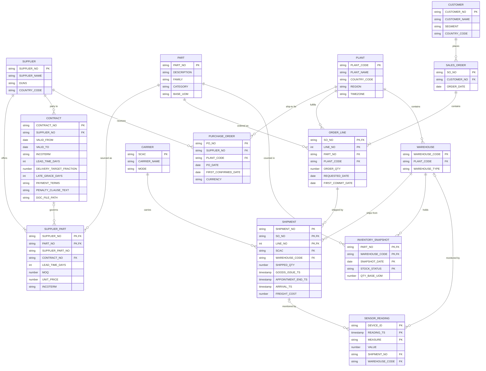

# Supply Chain Ontology

A shared vocabulary for the supply chain platform. Every metric in [`conflict_matrix.md`](conflict_matrix.md) is defined only in terms of the entities, relationships and hierarchies below. Conformed objects live in `SC.CONFORMED`; semantic views in `SC.SEMANTIC` expose the synonyms.

**Conventions**
- **Natural key** = the business identifier as the system of record issues it. Conformed tables add a surrogate key, but joins across systems are resolved through natural keys and crosswalks.
- **System of record (SoR)** wins on conflict; other sources enrich or are reconciled against it.
- Source systems: **ERP** (`SC.RAW_ERP`), **Logistics** TMS / WMS / carriers (`SC.RAW_LOGISTICS`), **Supplier** SRM / portal / EDI (`SC.RAW_SUPPLIER`), **IoT** (`SC.RAW_IOT`), **Docs** (`SC.RAW_DOCS`).

---

## 1. Entities

| Entity | Business definition | Natural key | System of record | Other sources | Typical source tables |
|---|---|---|---|---|---|
| **Supplier** | A legal entity we buy parts or materials from. | `SUPPLIER_NO` (ERP vendor number) | ERP | Supplier (portal ID, DUNS, scorecard) | `RAW_ERP.VENDOR_MASTER`, `RAW_SUPPLIER.SUPPLIER`, `RAW_SUPPLIER.SUPPLIER_SITE` |
| **Part** | A distinct item we buy, make, stock or sell, identified in its base unit of measure. The leaf (SKU) of the Part hierarchy. | `PART_NO` (ERP material number) | ERP | Logistics (WMS item), Supplier (supplier part numbers via SupplierPart) | `RAW_ERP.MATERIAL_MASTER` |
| **SupplierPart** | Crosswalk recording that a Supplier is approved to supply a Part, with the supplier's own part number and sourcing terms (lead time, MOQ, price, Incoterm). Resolves supplier part numbers to our `PART_NO`. | `SUPPLIER_NO` + `PART_NO` | Supplier | ERP (purchasing info record / source list) | `RAW_SUPPLIER.CONTRACT_PRICE`, `RAW_ERP.PURCHASING_INFO_RECORD` |
| **PurchaseOrder** | A commitment to buy parts from a Supplier for delivery to a Plant. Header grain; PO lines are an extension (see §6). | `PO_NO` | ERP | Supplier (EDI 855 acknowledgement, EDI 856 ASN) | `RAW_ERP.PURCHASE_ORDER_HEADER`, `RAW_SUPPLIER.PO_ACKNOWLEDGEMENT` |
| **Plant** | A physical company site that makes, receives or ships goods. The leaf of the Geography hierarchy. | `PLANT_CODE` | ERP | Logistics (TMS location), IoT (geofence) | `RAW_ERP.PLANT` |
| **Warehouse** | A storage area within a Plant where inventory is held and from which shipments depart. | `WAREHOUSE_CODE` (ERP storage location) | ERP | Logistics (WMS warehouse ID) | `RAW_ERP.STORAGE_LOCATION`, `RAW_LOGISTICS.WMS_INVENTORY` |
| **Carrier** | A company that physically moves goods for us. | `SCAC` (Standard Carrier Alpha Code) | Logistics | ERP (carrier as vendor) | `RAW_LOGISTICS.CARRIER` |
| **Customer** | A legal entity that buys from us (sold-to party). The leaf of the Customer hierarchy. | `CUSTOMER_NO` (ERP sold-to number) | ERP | Logistics (consignee / ship-to) | `RAW_ERP.CUSTOMER` |
| **SalesOrder** | A Customer's request to buy, as accepted by us. | `SO_NO` | ERP | — | `RAW_ERP.SALES_ORDER_HEADER` |
| **OrderLine** | One Part, quantity and commit date on a SalesOrder. The grain for On-Time Delivery and Fill Rate. | `SO_NO` + `LINE_NO` | ERP | — | `RAW_ERP.SALES_ORDER_LINE` |
| **Shipment** | The physical movement of (part of) one OrderLine by one Carrier from a Warehouse, with appointment, arrival and freight facts. Grain is shipment × order line, so one OrderLine split across two trucks is two Shipment rows. | `SHIPMENT_NO` + `SO_NO` + `LINE_NO` | Logistics | ERP (outbound delivery / goods issue), IoT (geofence arrival) | `RAW_LOGISTICS.SHIPMENT`, `RAW_LOGISTICS.SHIPMENT_LINE`, `RAW_LOGISTICS.CARRIER_EVENT`, `RAW_LOGISTICS.PROOF_OF_DELIVERY`, `RAW_ERP.DELIVERY` |
| **InventorySnapshot** | The quantity of a Part held in a Warehouse at a point in time, by stock status. | `PART_NO` + `WAREHOUSE_CODE` + `SNAPSHOT_DATE` + `STOCK_STATUS` | ERP (book stock) | Logistics (WMS physical stock, reconciled) | `RAW_ERP.INVENTORY_BALANCE`, `RAW_LOGISTICS.WMS_INVENTORY` |
| **SensorReading** | A single measurement (location, temperature, humidity, shock, door event) from an IoT device attached to a Shipment or installed in a Warehouse. | `DEVICE_ID` + `READING_TS` + `MEASURE` | IoT | Logistics (device ↔ shipment assignment) | `RAW_IOT.SENSOR_READING`, `RAW_IOT.GPS_PING`, `RAW_IOT.GEOFENCE_EVENT`, `RAW_IOT.DEVICE_ASSIGNMENT` |
| **Contract** | A supply agreement with a Supplier defining price, Incoterm, lead time, tolerances and penalties for the SupplierParts it covers. | `CONTRACT_NO` | Supplier | Docs (signed PDF is the legal source), ERP (outline agreement) | `RAW_DOCS.CONTRACTS` (stage) → `RAW_DOCS.CONTRACT_PAGES` (parsed text); `RAW_SUPPLIER.CONTRACT_TERMS` is not delivered yet, so PDF terms are reconciled against `SUPPLIERS`, `SUPPLIER_PARTS` and `PURCHASE_ORDERS` (`SC.OPS.DQ_CONTRACT_TERMS_RECON`) |

---

## 2. Relationships

Cardinality is read left to right: `A *..1 B` means many A belong to exactly one B.

| # | Relationship | Cardinality | Join (natural keys) | Meaning |
|---|---|---|---|---|
| R1 | Supplier → SupplierPart | Supplier `1..*` SupplierPart | `SUPPLIER_NO` | Every approved supplier offers at least one part |
| R2 | SupplierPart → Part | SupplierPart `*..1` Part | `PART_NO` | A part can be dual- or multi-sourced; a part with no SupplierPart is make-only |
| R3 | PurchaseOrder → Supplier | PurchaseOrder `*..1` Supplier | `SUPPLIER_NO` | Each PO is placed with one supplier |
| R4 | PurchaseOrder → Plant | PurchaseOrder `*..1` Plant | `PLANT_CODE` | Receiving (ship-to) plant |
| R5 | Contract → Supplier | Contract `*..1` Supplier | `SUPPLIER_NO` | Each contract has one supplier counterparty |
| R6 | SupplierPart → Contract | SupplierPart `*..0..1` Contract | `CONTRACT_NO` | Governing contract; spot buys have none |
| R7 | OrderLine → SalesOrder | OrderLine `*..1` SalesOrder | `SO_NO` | Lines belong to one order |
| R8 | SalesOrder → Customer | SalesOrder `*..1` Customer | `CUSTOMER_NO` | Sold-to customer |
| R9 | OrderLine → Part | OrderLine `*..1` Part | `PART_NO` | Part ordered |
| R10 | OrderLine → Plant | OrderLine `*..1` Plant | `PLANT_CODE` | Fulfilling (shipping) plant |
| R11 | Shipment → OrderLine | Shipment `*..1` OrderLine | `SO_NO` + `LINE_NO` | A line may ship in several partial shipments |
| R12 | Shipment → Carrier | Shipment `*..1` Carrier | `SCAC` | Carrier that moved it |
| R13 | Shipment → Warehouse | Shipment `*..1` Warehouse | `WAREHOUSE_CODE` | Origin warehouse |
| R14 | Warehouse → Plant | Warehouse `*..1` Plant | `PLANT_CODE` | Warehouses roll up to plants |
| R15 | InventorySnapshot → Part | InventorySnapshot `*..1` Part | `PART_NO` | Part counted |
| R16 | InventorySnapshot → Warehouse | InventorySnapshot `*..1` Warehouse | `WAREHOUSE_CODE` | Where it is held |
| R17 | SensorReading → Shipment | SensorReading `*..0..1` Shipment | `DEVICE_ID` + `READING_TS` within `DEVICE_ASSIGNMENT` validity window → `SHIPMENT_NO` | In-transit telemetry; source of physical arrival time |
| R18 | SensorReading → Warehouse | SensorReading `*..0..1` Warehouse | `DEVICE_ID` → installed `WAREHOUSE_CODE` | Fixed sensors (cold rooms, dock doors) |

Each SensorReading links to **either** a Shipment **or** a Warehouse, never both.

---

## 3. ER diagram

---

## 4. Hierarchies

| Hierarchy | Levels (top → leaf) | Leaf entity | Level attributes | Source | Rules |
|---|---|---|---|---|---|
| **Part** | Category > Family > SKU | Part | `CATEGORY`, `FAMILY`, `PART_NO` | ERP material group / product hierarchy | Each SKU belongs to exactly one Family and each Family to one Category. Reclassifications are effective-dated so history keeps its original roll-up. |
| **Geography** | Region > Country > Plant | Plant | `REGION`, `COUNTRY_CODE` (ISO 3166-1 alpha-2), `PLANT_CODE` | ERP plant master + region mapping | Region is a company definition (e.g. AMER / EMEA / APAC) mapped from country. Warehouse can be added as an optional fourth level below Plant (via R14). |
| **Customer** | Segment > Customer | Customer | `SEGMENT`, `CUSTOMER_NO` | ERP customer master (customer group) | Each Customer belongs to exactly one Segment at a time; segment changes are effective-dated. |
| **Time** | Year > Quarter > Month > Week > Day | Day (date) | `YEAR`, `QUARTER`, `MONTH`, `WEEK`, `DATE` | Generated calendar table `CONFORMED.DIM_DATE` | Calendar weeks cross month boundaries, so this path only nests strictly on a **4-4-5 fiscal calendar**, which is the recommended default. If calendar months are required, Week becomes a separate path (Year > Week > Day). |

**Time is role-playing.** The same calendar is joined under different roles, and the role must be stated in every metric definition:

| Date role | Entity.attribute | Used by |
|---|---|---|
| Order date | `SALES_ORDER.ORDER_DATE`, `PURCHASE_ORDER.PO_DATE` | Volume reporting |
| Commit date | `ORDER_LINE.FIRST_COMMIT_DATE`, `PURCHASE_ORDER.FIRST_CONFIRMED_DATE` | OTD and Fill Rate period assignment |
| Arrival date | `SHIPMENT.ARRIVAL_TS` (IoT → POD → GR fallback) | OTD actual |
| Snapshot date | `INVENTORY_SNAPSHOT.SNAPSHOT_DATE` | Days of Inventory |

Timestamps are converted to the local time zone of the **receiving location** before a date is taken: the receiving Plant (`PLANT.TIMEZONE`) for inbound, the customer ship-to for outbound. Date-only business fields are never converted. The full rule is in [`metric_contracts.md`](metric_contracts.md) §1.2.

---

## 5. Business synonyms

These feed the `synonyms` of the semantic views in `SC.SEMANTIC`, so that "vendor fill rate" and "supplier fill rate" resolve to the same thing.

| Entity | Synonyms | Source-system terms |
|---|---|---|
| Supplier | vendor, seller, source, manufacturer, provider | ERP: vendor, creditor · Supplier portal: trading partner |
| Part | SKU, material, item, product, component, article | ERP: material · WMS: item · Supplier: supplier part number (via SupplierPart) |
| SupplierPart | vendor item, approved vendor part, source of supply, catalog item | ERP: purchasing info record, source list · AVL entry |
| PurchaseOrder | PO, purchase order, buy order, release | ERP: purchasing document · EDI: 850 |
| Plant | site, facility, factory, location | ERP: plant · TMS: location / facility |
| Warehouse | DC, distribution center, storage location, depot, fulfillment center | ERP: storage location · WMS: warehouse / site |
| Carrier | transporter, haulier, trucker, freight provider, LSP | TMS: carrier · EDI: SCAC |
| Customer | client, account, buyer, sold-to | ERP: sold-to party, debtor · TMS: consignee (ship-to) |
| SalesOrder | SO, customer order, order | ERP: sales document · EDI: 850 (inbound from customer) |
| OrderLine | line, line item, order item, SO line | ERP: sales order item, schedule line |
| Shipment | load, consignment, freight, BOL | TMS: shipment / load · ERP: outbound delivery · Carrier: PRO number |
| InventorySnapshot | stock, on-hand, stock position, inventory balance | ERP: stock overview · WMS: inventory |
| SensorReading | telemetry, IoT reading, device event, ping | IoT: reading, event, message |
| Contract | agreement, supply agreement, MSA | ERP: outline agreement, scheduling agreement · CLM: contract |

**Ambiguous terms.** Resolve these from context; never map them blindly.

| Term | Possible meanings | Resolution |
|---|---|---|
| "order" | SalesOrder or PurchaseOrder | Customer / sell side → SalesOrder; supplier / buy side → PurchaseOrder |
| "delivery" | ERP outbound delivery doc, Shipment, or the arrival event | Document → Shipment (ERP source); event → `SHIPMENT.ARRIVAL_TS` |
| "location" / "site" | Plant, Warehouse, or a customer ship-to | Default Plant; Warehouse when stock or picking is involved |
| "item" | Part, OrderLine, or PO line | Catalog context → Part; order context → OrderLine |
| "shipper" | The sending party (us or a supplier), *not* the Carrier | Never maps to Carrier |
| "fill rate" | Order fill (Fill Rate) vs trailer utilization | See `conflict_matrix.md`: trailer meaning → *Trailer Utilization* |

---

## 6. Metric bindings and known extensions

| Canonical metric (see `conflict_matrix.md`) | Grain entity | Entities traversed |
|---|---|---|
| On-Time Delivery | OrderLine | OrderLine → Shipment (`ARRIVAL_TS`) → SensorReading (geofence); Time role = Commit date |
| Fill Rate | OrderLine | OrderLine → Shipment (`SHIPPED_QTY` arrived by commit date) |
| Days of Inventory | InventorySnapshot | InventorySnapshot → Part, Warehouse → Plant; demand from OrderLine / forecast |
| Landed Cost | PurchaseOrder (line) | PurchaseOrder → SupplierPart → Contract; freight from inbound Shipment |

**Modelling assumptions to revisit:**
- **Shipment is outbound only** (`Shipment *..1 OrderLine`). Inbound supplier OTD and Landed Cost need a **PurchaseOrderLine** entity (`PO_NO` + `PO_LINE_NO`, `*..1` PurchaseOrder, `*..1` SupplierPart) and an inbound shipment link to it. *Today the inbound consignment is the supplier ASN: inbound arrival evidence (IoT geofence entry `RAW_IOT.INBOUND_GEOFENCE_EVENTS`, carrier POD `RAW_LOGISTICS.INBOUND_CARRIER_POD`) is keyed by `ASN_ID` → PO line (`CONFORMED.DT_INBOUND_ARRIVAL`).*
- **Shipment grain is shipment × order line.** A truck carrying 20 order lines is 20 Shipment rows. Truck-level facts (freight cost, trailer utilization) must be allocated or kept in a separate `Load` entity to avoid double-counting.
- **Contract covers suppliers only.** Carrier rate agreements (lanes, rates) belong in a separate entity if freight-cost governance is needed.
